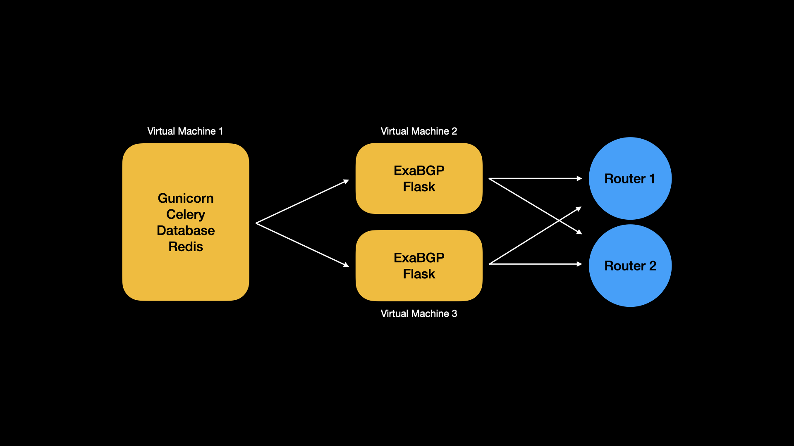
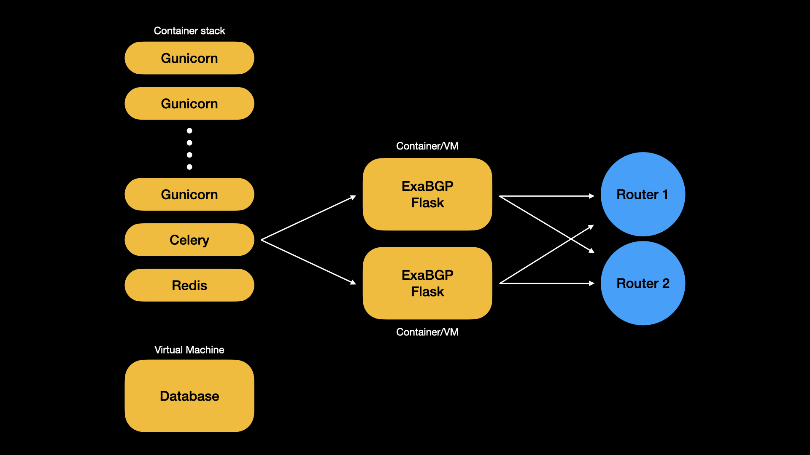

# Possible approaches to deployments

FoD has users who deploy directly onto a virtual machine, and users who deploy
using Docker. In the future, we need to support both.

We also need to support resilient service in two places:

- the GUI exposed to users (gunicorn)
- ExaBGP instances and onward BGP sessions to routers

Multiple Gunicorn instances are needed in a docker deployment, so as to
support seamless updates, and maintenance of the underlying container
infrastructure.

Multiple ExaBGP instances are needed because, if all BGP sessions go down
(e.g. for an upgrade) then all rules are dropped by the user's network
equipment.

Celery jobs can tolerate a delay of a few seconds to a couple of minutes,
and so resilient Celery instances are less essential.

So how do we do that? This is a proposal.

## VM deployment

When installing FoD on a single large VM, uptime of the service is (at best)
equivalent to uptime of the underlying VM, so we don't propose to run
multiple instances of Gunicorn. However, the BGP sessions do need to survive
the reboot of a single server, so we recommend running at least two instances,
on separate machines from the main installation.

To do this, we need remote communication between Celery and ExaBGP, and we
need to make sure that any sensitive information (like configuration data) is
kept secure.

The proposed solution is to run a very lightweight Flask instance on the same
VM as each ExaBGP installation. Then add an API endpoint to Gunicorn that
provides a full or partial ExaBGP config.

The Flask application has this job: when triggered over HTTP by a remote
Celery instance

1. Fetch an updated config from Gunicorn
2. Overwrite the existing `exabgp.conf` file with the new config
3. Send a `SIGUSR1` to cause ExaBGP to reload the config

This also allows ExaBGP instances to run effectively statelessly. If a new
ExaBGP instance is brought up, it will immediately fetch and implement a
full set of FoD rules.

## Docker deployment

There are a lot of ways to deploy Docker containers (e.g. manually, Swarm,
Kubernetes) and it's a little early in FoD's life cycle to settle on a
particular approach. So this proposal is to make some official container
images available for users to deploy as appropriate to their environment.

We would build and provide two container images:

1. FoD (which can be run as Gunicorn or Celery)
2. ExaBGP/Flask

The FoD image should be run as part of a stack with one or more Gunicorn
containers, a single Celery container, and a Redis container (since Redis
doesn't need to provide persistent storage.) A separate database should be
provided by the user; this might be in another container or a separate
database setup already provided by the user's organisation.

In this scenario, the container stack provides resilience for the GUI.
We can use Docker's own healthcheck and restart facilities to manage
outages, and its load balancing to send requests to live containers.
Since all containers are using the same database to hold all their
state (so nothing peristent stored on their own filesystems), the
containers are all kept in sync.

Running BGP containers from inside a container can be fraught, due to
NAT and load balancing, so while we can provide ExaBGP container images,
they may be run on individual machines (not part of a stack) or the
ExaBGP/Flask combination might be run on separate VMs as in the earlier
scenario.

## Still to decide

- How to pass settings into containers: env vars? mounted files?
- How to secure the Flask instance in a VM scenario?
- Is there really nothing in the filesystem that could cause race conditions?
